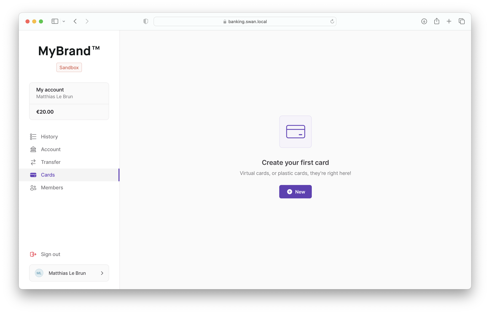
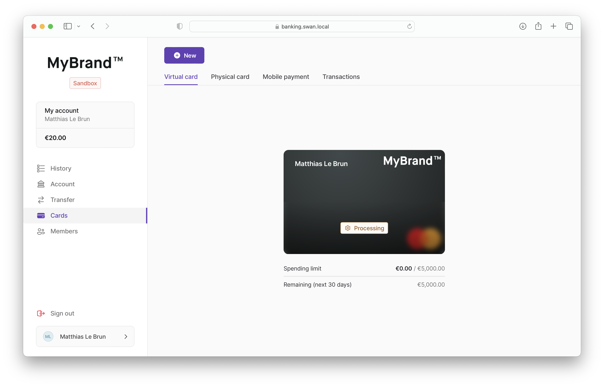

# Cards

The **cards** page is presented differently based on the user's account membership settings, so let's review the GraphQL queries first.

## GraphQL queries

### With account access

The following query works if the user can access the account (`canViewAccount`: `true`).

Retrieve all the account cards using the root `cards` query field and an `accountId` filter:

```graphql
query {
  cards(filters: {accountId: $CURRENT_ACCOUNT_ID}) {
    # ....
  }
}
```
### No account access

The following query works if the user doesn't have view access to the account (`canViewAccount`: `false`).

Retrive cards attached only to their membership:

```graphql
query {
  accountMembership(id: $CURRENT_ACCOUNT_MEMBERSHIP_ID) {
    cards {
      # ...
    }
  }
}
```

## Card list views

The view of the card list changes based on how many cards are displayed.

### No cards

If the **query returns no cards**, provide a way for users to add a card.
No other content is needed in the body of the page.



### Single card

If the **query returns a single card**, the body of the page should include the following content:

- Tabs for **virtual cards**, **physical cards**, **mobile payments**, and **transactions**
- **Large image** of the card with all card details (such as cardholder name, card number)
- Card's **spending limit**
- **Remaining amount available** to be spent over the next 30 days



### Multiple cards

If the **query returns multiple cards**, the body of the page should include the following content in a list format:

- Button to add a new card
- Filters for **status** and **format**
- List of cards
  - Small image of the card
  - Full name and card format
  - Card name
  - Spending limit (remaining balance over total spending limit)


